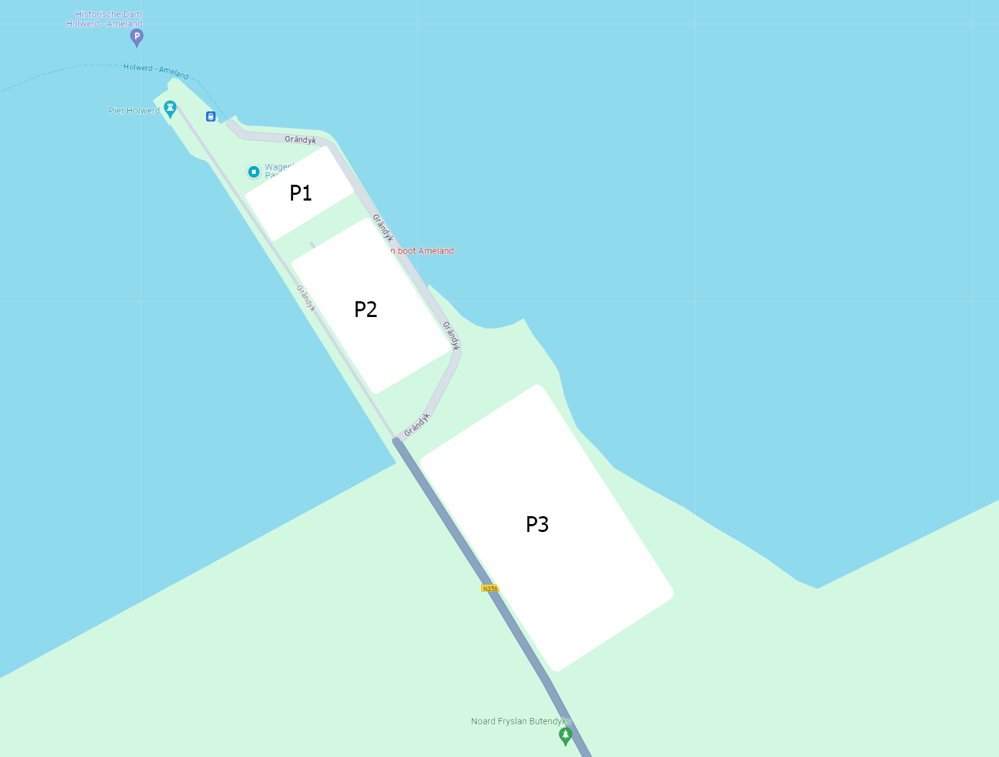

# Streams workshop

This repo is used as a workshop to experiment with streams

## Difference of programming

Imperative: (Tell what and how)
```java
public List<String> getAddresses(List<Person> persons) {
    List<String> addresses = new ArrayList<>();
    for (int i = 0; i < persons.size(); i++) {
        Person person = persons.get(i);
        if (person.hasValidData()) {
            String address = person.getAddress();
            addresses.add(address.trim());
        }
    }
    return addresses;
}

```

Declarative (Tell what is does, not how)
```java
public List<String> getAddresses(List<Person> persons) {
    return persons.stream()
            .filter(person -> person.hasValidData())
            .map(person -> person.getAddress())
            .map(address -> address.trim())
            .collect(Collectors.toList());
}
```

Better readable and immutable


## Streams workshop story

When you are going to an island it is common to leave the car at the harbor.
For this harbor there are some parking area's with different amount of spots.
 

_This picture is fictional_

To you start the exercises to report all kind of statistics.